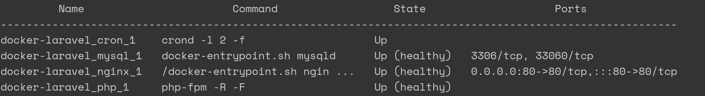

# Docker Deployment for Laravel Applications

This repository implements Docker containers to facilitate the deployment of Laravel applications. It's goal is to be useful for creating both development and production environments.

## How to Install

### Download

To get started, clone the `hawara/docker-laravel` repository.

```bash
# Using SSH
git clone git@github.com:hawara-es/docker-laravel.git

# ... or HTTPS
git clone https://github.com/hawara-es/docker-laravel.git
```

### Choose Services

Once you have the repository, use the `create-environment` script to create:

- an environment file, `.env`, with random passwords to speed up the installation,
- a `docker-laravel` script to manage your containers.

Call the script by running `./create-environment` from the terminal followed by the names of the services separated by spaces.

```bash
# cd docker-laravel/
./create-environment mysql
```

Available services are:

- `letsencrypt`: installs Let's Encrypt `certbot` utility to facilitate serving the application through HTTPS,
- `mysql`: runs a MySQL database server,
- `redis`: runs a Redis server,
- `supervisor`: runs a Supervisor instance checking Laravel's queues.

Also, this features are available:

- `dev`: enables XDebug and opens MySQL port to the host,
- `mailhog`: enables a MailHog email catcher,

#### Service Versions

| Service | Version |
| --- | --- |
| PHP | 8.1 |
| Alpine | 3.16 |
| Nginx | 1.22 |
| MySQL | 8.0 |
| MariaDB | 10.8 |
| Redis | 7.0 |

#### Environment Variables

When you created the environment, a new `.env` file was created with some random passwords. The file is as basic as possible, so you must check it and complete it with all the variables that your Laravel application needs.

### Build

Now you should have a custom `docker-laravel` script that will help you when interacting with your containers. For instance, you can now build the selected containers.

```bash
./docker-laravel build
```

#### Set the Timezone

When calling `build` one of the first things you want to do is to set the server TIMEZONE. Use the `TIMEZONE` build argument for that. Valid values are the ones accepted in `php.ini` files.

```bash
./docker-laravel build --build-arg TIMEZONE=Europe/Madrid
```

In the next examples, the timezone argument will be excluded for simplicity. Remember adding it to your custom build command.

#### Install the Application

First, let's start the containers.

```bash
./docker-laravel up -d
```

Temporarily, our web server container may report unhealthy. That's just because we still don't have anything in the web root.

As an example, let's install a clean new Laravel manually:

```sh
# 1) Create the project in a new folder (here `download`)
./composer create-project laravel/laravel download/

# 2) Open a shell in the PHP container
./shell php

# 3) Move the files and leave things clean
cp -R download/* . && rm -rf download/

# 4) Generate the application keys
./artisan key:generate
```

### Check the Services

This repository implements health checks for MySQL, Nginx and PHP FPM. If you run a `ps` in Docker, you should see each service status.

```bash
./docker-laravel ps
```



## How to Use

### Run `artisan` Commands

All `artisan` commands can be called using the so-called helper.

```bash
./artisan key:generate
```

### Run `composer` Commands

Also, all `composer` commands can be called using the so-called helper.

```bash
./composer update
```

### Open `shell` Sessions

To administrate the containers, `shell` sessions can be created.

```bash
# Open a shell in the `php` container
./shell php

# ... or in the `nginx` container
./shell nginx
```
